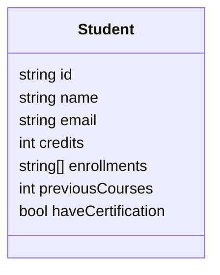
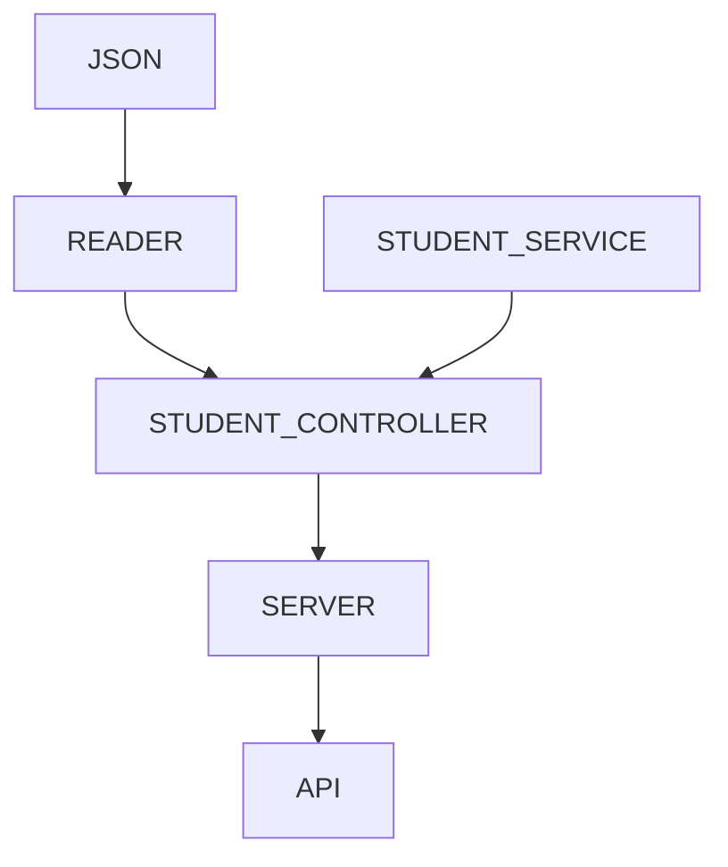

# launchx-code-challenge
LaunchX practice for backend project: Visual Partner-ship's Visual Thinking API

This project is a small API to get the information about the students of Visual Partner-Ship, which are stored in a json file.

A student object is defined as follows:



## Contents
- [API](#api)
  - [Request Guide](#request-guide)
- [Project Structure](#project-structure)
  - [Overview](#overview)
  - [Dependencies](#dependencies) 
- [Classes and Tests](#classes-and-tests)
  - [Reader](#reader)
  - [StudentService](#studentservice)
  - [StudentController](#studentcontroller)
  - [Server](#server)
  
# API
## Request Guide
The server is set to run on localhost/3000 ([Server script](#server)), so the urls need to be written as follows:<br>
``http://localhost:3000[endpoint]``

By default, ``http://localhost:3000/`` is a landing page:<br>


### Endpoints

There are currently 3 endpoints to use:<br>

#### GET all students
``/v1/students``: Gets a list of all the students.<br><br>


#### GET students by certification
``/v1/students/certification=:certification``: Gets a list of the students that are or aren't certified.
- Replace ``:certification`` with `true` or `false`<br><br>


#### GET students by credits
``/v1/students/credits:expression``: Gets a list of students whose credits match a boolean expression.
- Replace ``:expression`` with an expression such as ``<=100``, ``>=60``, ``==654`` and the like.
  - Valid operators: "==", "<=", ">=", "<", ">". This can be edited in [StudentService script](#studentservice.js)
  - An invalid operator results in an error message.<br><br>
<br>


# Project Structure
## Overview
The API handles requests by a given url, and returns a result. This is done by the use of the following structure:



This means:
1. The API receives a request and the Server receives it
2. The Server calls the Controller to get the info
3. The Server uses the Reader, which takes the info from the Json file. This is so it gets the students from the Reader and, with it, call the Service to get the info
4. The Service manages the logic of the needed method and returns it

## Dependencies
The dependencies used and how to install them from terminal.
### Express
``npm install express --save``

### Jest
``npm install jest@26.0.0 --save-dev``

### Eslint
``npm install eslint --save-dev``

# Classes and Tests
## Reader
### [Reader.js](https://github.com/oscar-cbrlc/launchx-code-challenge/blob/main/lib/utils/Reader.js)
This class reads a json file and parses it's content into a JavaScript object.
```Javascript
const fs = require("fs");

class Reader {
    static readJsonFile(filePath) {
        const rawdata = fs.readFileSync(filePath)
        return JSON.parse(rawdata);
    }
}

module.exports = Reader;
```

### [Reader.test.js](https://github.com/oscar-cbrlc/launchx-code-challenge/blob/main/test/utils/Reader.test.js)
This tests if the Reader is doing it's job, and actually returning an object from the json file.
```Javascript
const Reader = require("./../../lib/utils/Reader");
const jsonFile = "visualpartners.json";
describe("Read class testing", () => {
    test("should return a parsed js object from json file", () => {
        const parsedObject = Reader.readJsonFile(jsonFile);
        expect(parsedObject).not.toBeUndefined();
    });
});
```

## StudentService
### [StudentService.js](https://github.com/oscar-cbrlc/launchx-code-challenge/blob/main/lib/services/StudentService.js)
This class is the core of the logic behind the requests, and it's purpose is to handle individual requirements that involve students.

#### filterByCertification
This method returns a list of students whose ``haveCertification`` attribute matches the condition (true or false) given by ``hasCertification`` 
```Javascript
static filterByCertification(students, hasCertification) {
        return students.filter(student => student.haveCertification == hasCertification)
    }
```
 
#### filterByCredits
```Javascript
static filterByCredits(students, expressionValue) {
    const validExpressions = ["==", "<=", ">=", "<", ">"]
    try {
        var validExpression = false;
        for (let ex of validExpressions) {
            validExpression = expressionValue.includes(ex);
            if (validExpression) break;
        }
        if (!validExpression) throw {error: `invalid expression "${expressionValue}"`, validExpressions: validExpressions};

        return students.filter((student) => {
            const expression = Function(`return ${student.credits} ${expressionValue}`);
            return expression();
        })
    }
    catch(ex) {
        throw ex;
    }
}
```
This method returns a list of students whose ``credits`` attribute matches the condition (true or false) given by an ``expressionValue`` contained in a list of ``validExpressions``:
- ``expresionValue`` is expected to be a string expression to that can be applied to numbers in mathematics, such as ``<=100``, ``">=60``, ``==654`` and the like.
- ``validExpressions``is a list of valid operators, represented as strings, to evaluate the expression: ``["==", "<=", ">=", "<", ">"]``

With this values, the method filters the list, had evaluated the expression. This is done with the following steps:
1. Surrounds the main code into a try-catch block.<br>
  Since there exists the possibility that ``expressionValue`` is invalid, this ensures that the code will not break when it raises the exception, and leaves the
  task to handle the error to whoever this method is called by.

2. Initializes a bool variable ``validExpression`` as false.<br>
  This variable will tell us if the expression is valid after going through inspection.

3. In a for loop, checks if ``expressionValue`` includes any of the operators contained in the list ``validExpressions``. 
   This value (true or false) is assigned to ``validExpression``.<br>
  Since it only needs to know if *any* operator is a substring of ``expressionValue``, as soon as ``validExpression`` is true, it breaks the loop.
  
4. Checks the value of ``validExpression``.<br>
  If it's false, it means the expression doesn't contain any of the valid operators, therefore, 
  throws an object as an error message saying that the expression is invalid.<br>
  Otherwise, the expression is correct and it can be evaluated.
  
5. Evaluates the expression in an anonymous method.
  Uses the array method ``filter`` to evaluate the result of the expression returned by a created function whose only purpose is to:
    - return an evaluated statement that joins both the credits (which is what this filter function is about) and the given expression.<br>
      This can result in something like:
      ```Javascript
      return student.credits <=100
      ```
  In this example, when ``student.credits`` is less than or equal to 100, that student will be added to the list of students that match that condition.
  


## StudentService
### [StudentService.test.js](https://github.com/oscar-cbrlc/launchx-code-challenge/blob/main/lib/services/StudentService.test.js)
In summary, the tests for the class expect the methods to return correct values, given created objects that simulate as students.<br>
For the method ``filterByCredits``, there is also a test that expects the method to throw an error if the expression is not valid. 

```Javascript
### [StudentService.test.js](https://github.com/oscar-cbrlc/launchx-code-challenge/blob/main/test/services/StudentService.test.js)
const StudentService = require("./../../lib/services/StudentService")

describe('Tests for filterByCertification', () => {
    test('should get students by certification', () => {
        const students = [{id: "123a", haveCertification: true},{id: "456b", haveCertification:false},{id: "789c", haveCertification:true}]
        const studentsFiltered = StudentService.filterByCertification(students, true);
        expect(studentsFiltered).toEqual([{id: "123a", haveCertification: true}, {id: "789c", haveCertification:true}]);
    });
});

describe('Tests for filterByCredits', () => {
    test('should return correct objects', () => {
        const students = [{credits: 0},{credits: 50},{credits: 100}]
        const studentsFiltered = StudentService.filterByCredits(students, ">50")
        expect(studentsFiltered).toEqual([{credits: 100}])
    });
    test('should throw an exception if invalid expression', () => {
        const students = [{credits: 0},{credits: 50},{credits: 100}]
        expect(() => {
            StudentService.filterByCredits(students, "=100");
        }).toThrow();
    });
});
```

## StudentController
### [StudentController.js](https://github.com/oscar-cbrlc/launchx-code-challenge/blob/main/lib/controllers/StudentController.js)
This class is the bridge between the Server, the Reader and the Service, meaning it's purpose is to get the values from the request and send them to 
the logic manager [StudentService](#studentservice) to receive the processed info and return it to the request from Server.

The methods of this class take the students info to send it to the Service, so in the imports includes [Reader](#Reader) and [StudentService](#StudentService).
```Javascript
const Reader = require("./../../lib/utils/Reader");
const StudentService = require("./../../lib/services/StudentService");
```

#### getAll
This method simply returns the strudents info stored in the ``jsonFile`` and processed by the Reader. 
```Javascript
static getAll() {
    return Reader.readJsonFile(jsonFile);
}
```

#### getByCertification
This method receives a ``hasCertification`` parameter that indicates if we want to look for explorers with certification (true) or without it (false).<br>
Simply takes the list of students from [``getAll``](#getall) and returns the list filtered by the [``filterByCertification``](#filterbycertification) method from StudentService.
```Javascript
static getByCertification(hasCertification) {
    const students = this.getAll();
    return StudentService.filterByCertification(students, hasCertification);
}
```

#### getByCredits
This method receives an expression expected to be in the form of a string, such as ``<=100``, ``>=60``, ``==654`` and the like, with the 
purpose of getting all the students whose credits matches the expression.
[``StudentService.filterByCredits``](#filterbycredits) is the method that does the logic for this, so we only need to call it 
with the list of students (from [``getAll``](#getall)), and the ``expression`` given.<br>
As we know, that method throws an error if the expression is invalid, so we handle the possible error surrounding the call to the function in a 
try-catch block. In case of catching an error, it simply returns it.

```Javascript
static getByCredits(expression) {
    const students = this.getAll();
    const validExpressions = ["==", "<=", ">=", "<", ">"];
    try {
        return StudentService.filterByCredits(students, expression);
    } catch (error) {
        return error;
    }
}
```

### [StudentController.test.js](https://github.com/oscar-cbrlc/launchx-code-challenge/blob/main/test/controllers/StudentController.js)
In summary, the tests for [StudentController](#studentcontroller.js), consist in:

1. Get the students from the json file, using the [Reader](#reader).
2. Get the result from the required [StudentService](#studentservice.js) method.
3. Get the result from the required [StudentController](#studentcontroller.js) method.
4. Compare both results.

This is simply because all the tests for the correct functioning of the filtered lists are already in the tests for [StudentService](#studentservice.test.js) 
and we only want to make sure that this class is behaving properly as the bridge.
Not all the tests follow these steps, but the purpose is the same.

```Javascript
const StudentController = require("../../lib/controllers/StudentController");
const StudentService = require("./../../lib/services/StudentService");
const Reader = require("./../../lib/utils/Reader");

describe('Tests for getAll', () => {
    test('should get all the elements in the list', () => {
        const students = Reader.readJsonFile("visualpartners.json");
        const result = StudentController.getAll();
        expect(result).toEqual(students);
    });
});

describe('Tests for getByCertification', () => {
    test('should get the correct students', () => {
        const students = Reader.readJsonFile("visualpartners.json");
        const resultFromService = StudentService.filterByCertification(students, true);
        const resultFromController = StudentController.getByCertification(true);
        expect(resultFromController).toEqual(resultFromService);
    });
});

describe('Tests for getByCredits', () => {
    test('should get the correct students', () => {
        const students = Reader.readJsonFile("visualpartners.json");
        const resultFromService = StudentService.filterByCredits(students, "<=5", ["==", "<=", ">=", "<", ">"]);
        const resultFromController = StudentController.getByCredits("<=5");
        expect(resultFromController).toEqual(resultFromService);
    });
    test('should get error message if invalid expression', () => {
        const result = StudentController.getByCredits("-4");
        expect(result).toEqual({error: `invalid expression "-4"`, validExpressions: ["==", "<=", ">=", "<", ">"]});
    });
});
```

## Server
### [Server.js](https://github.com/oscar-cbrlc/launchx-code-challenge/blob/main/lib/server.js)
This class contains all the endpoints required for the API.
All the *backstage* work is handled by the Controller and the Service, so this script only:
1. Initializes the app to run in a given port.
2. Declares that it will use json to format the result.
3. Defines the HTTP methods (GET, PUT, POST, DELETE)
  - Defines the url for each endpoint.
  - Calls the required methods to process the request, given the parameters in the url.
  - Returns the result of those callings.
```Javascript
const express = require("express");
const StudentController = require("./controllers/StudentController");

const app = express();
app.use(express.json());

const port = 3000;

app.get("/", (req, res) => {
    res.json({message: "Welcome to Visualpartners API!"})
});

app.get("/v1/students", (req, res) => {
    const students = StudentController.getAll();
    res.json(students);
});

app.get("/v1/students/certification=:certification", (req, res) => {
    const hasCertification = Function(`return ${req.params.certification}`);
    const students = StudentController.getByCertification(hasCertification());
    res.json(students);
});

app.get("/v1/students/credits:expression", (req, res) => {
    const expression = req.params.expression;
    const students = StudentController.getByCredits(expression);
    res.json(students);
});

app.listen(port, () => {
    console.log(`Visualpartners API in localhost:${port}`)
});
```
